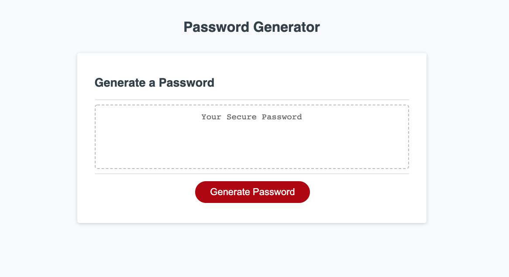
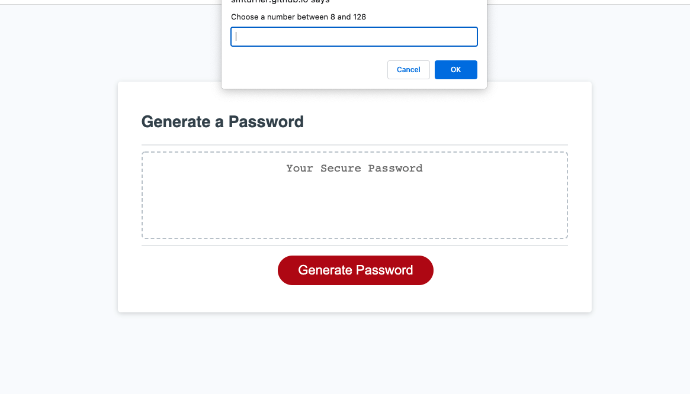
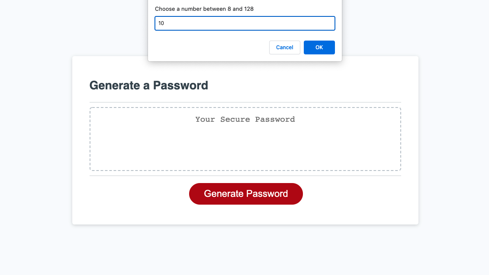
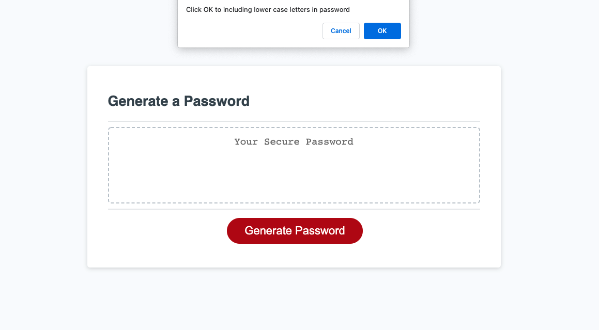

# password_generator

## Description
This project was to create a password generator using Javascript that when a button was pressed, pop-up screens come up that ask for how long you wanted the password and then what characters (upper/lowercase letters, numbers, special characters) you wanted to add into your password. Then it would generate a password on the screen for you.

## Screen-Shot

These photos shows what happens when the page gets deployed, the generate password button gets pressed and the pop-up menus start to depoly.

## Project Features

This project has the following features:
 <ul>
    <li> The generate password button, that when pressed pops up the user menu to populate the charaters for the password</li>
    <li> The pop-up allows the user to choose the length of the password and if they want to add uppercase letters, lowercase letters, numbers and special characters.</li>
    <li>User must put a number in between 8-128</li>
    <li>User must choose at least one of the character options or they will get an alert with an error</li>

</ul>

## Links to application

<a href="https://github.com/smturner/password_generator">GitHub link </a>

<a href= "https://smturner.github.io/password_generator/">Web Application link </a>

